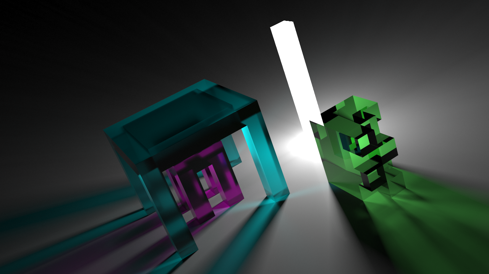
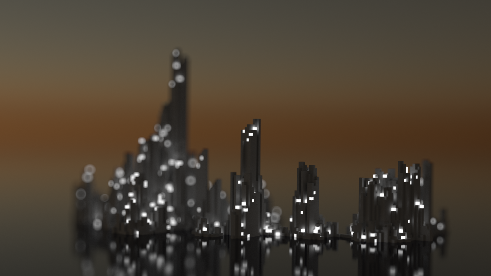
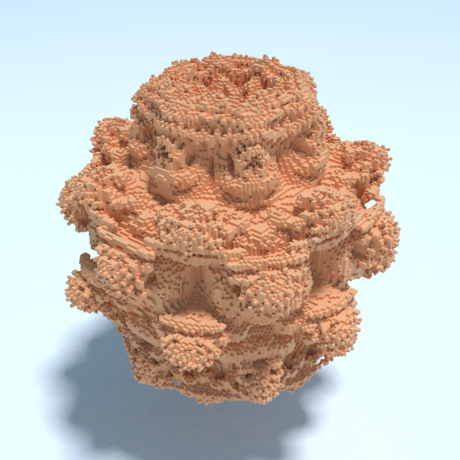
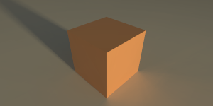

# Vixel

A WebGL path tracing voxel renderer built with [regl](https://github.com/regl-project/regl).







## Example

```js
const Vixel = require("vixel");

const canvas = document.createElement("canvas");
document.body.appendChild(canvas);

// Create a vixel object with a canvas and a width (x), height (y), and depth (z).
const vixel = new Vixel(canvas, 1, 1, 1);

vixel.camera(
  [2, 2, 2], // Camera position
  [0.5, 0.5, 0.5], // Camera target
  [0, 1, 0], // Up
  Math.PI / 4 // Field of view
);

vixel.set(
  0, // x
  0, // y
  0, // z
  {
    red: 1, // Red component
    green: 0.5, // Green component
    blue: 0.25 // Blue component
  }
);

// Take 1024 path traced samples per pixel
vixel.sample(1024);

// Show the result on the canvas
vixel.display();
```

The code in the example above will result in the following image:



## Installation

`npm i --save vixel`

## API

`const Vixel = require('vixel')`

### Constructor

#### `const vixel = new Vixel(canvas, width, height, depth)`

Returns a new `Vixel` object.

| Parameter | Type          | Description                                  |
| --------- | ------------- | -------------------------------------------- |
| canvas    | Canvas object | The canvas to render to.                     |
| width     | integer       | The width of the voxel grid (x-coordinate).  |
| height    | integer       | The height of the voxel grid (y-coordinate). |
| depth     | integer       | The depth of the voxel grid (z-coordinate).  |

### Methods

Methods marked with an asterisk (`*`) will reset the renderer. This will clear the collected samples and require new samples to converge the scene.

Methods marked with a double asterisk (`**`) will reset both the renderer _and_ require the voxel grid to be reuploaded to the GPU on the next call to
`vixel.sample`. Reuploading can be slow depending on the size of the voxel grid.

#### `vixel.set(x, y, z, options)**`

Sets a voxel at coordinates `x, y, z` with configuration `options`.

| Parameter | Type    | Description                                      |
| --------- | ------- | ------------------------------------------------ |
| x         | integer | The x-coordinate of the voxel.                   |
| y         | integer | The y-coordinate of the voxel.                   |
| z         | integer | The z-coordinate of the voxel.                   |
| options   | Object  | Configuration of the voxel. See `options` below. |

##### `options`

| Option      | Type  | Default | Description                                                                                                              |
| ----------- | ----- | ------- | ------------------------------------------------------------------------------------------------------------------------ |
| red         | float | 1.0     | The red component of the voxel color.                                                                                    |
| green       | float | 1.0     | The green component of the voxel color.                                                                                  |
| blue        | float | 1.0     | The blue component of the voxel color.                                                                                   |
| rough       | float | 1.0     | The roughness of the voxel surface. Zero is perfectly smooth, one is completely rough.                                   |
| metal       | float | 0.0     | The metalness of the voxel surface. Zero is completely nonmetallic, one is fully metallic.                               |
| transparent | float | 0.0     | The transparency of the voxel. Zero is completely opaque, one is completely clear.                                       |
| refract     | float | 1.0     | The refraction index of the voxel. Air has a value of 1.0, glass is around 1.333.                                        |
| emit        | float | 0.0     | The amount of light the voxel emits. If this is nonzero, `rough`, `metal`, `transparent`, and `refract` will be ignored. |

#### `vixel.unset(x, y, z)**`

Unsets the voxel at coordinates `x, y, z`.

#### `vixel.get(x, y, z)`

Returns the configuration of the voxel at coordinates `x, y, z`. See the `options` definition of `vixel.set` for information about the returned configuration
object. Returns `undefined` if the voxel at the given coordinates is not set.

| Parameter | Type    | Description                    |
| --------- | ------- | ------------------------------ |
| x         | integer | The x-coordinate of the voxel. |
| y         | integer | The y-coordinate of the voxel. |
| z         | integer | The z-coordinate of the voxel. |

#### `vixel.clear()**`

Clears the voxel grid.

#### `vixel.camera(eye, center, up, fov)*`

Configures the camera.

| Parameter | Type                  | Description                                          |
| --------- | --------------------- | ---------------------------------------------------- |
| eye       | float array [x, y, z] | The position of the camera.                          |
| center    | float array [x, y, z] | The point the camera is facing.                      |
| up        | float array [x, y, z] | The up direction. Typically [0, 1, 0].               |
| fov       | float                 | The field of view in radians. Typically around PI/3. |

#### `vixel.ground(color, rough, metal)*`

Configures the ground. Cannot currently be disabled.

| Parameter | Type                           | Description                                                                         |
| --------- | ------------------------------ | ----------------------------------------------------------------------------------- |
| color     | float array [red, green, blue] | The red, green, and blue color components of the ground.                            |
| rough     | float                          | The roughness of the ground. Zero is perfectly smooth, one is completely rough.     |
| metal     | float                          | The metalness of the ground. Zero is completely nonmetallic, one is fully metallic. |

#### `vixel.sun(time, azimuth, radius, intensity)*`

Configures the sky and sun.

| Parameter | Type  | Description                                                                                     |
| --------- | ----- | ----------------------------------------------------------------------------------------------- |
| time      | float | Time of day in hours, 0 to 24. 6.0 is sunrise, 18.0 is sunset.                                  |
| azimuth   | float | The angle of the sun on the horizon in radians. 0.0 places the sun in the positive-x direction. |
| radius    | float | The radius of the sun. 1.0 represents a physically-accurate sun radius.                         |
| intensity | float | The intensity of sunlight.                                                                      |

#### `vixel.dof(distance, magnitude)*`

Configures depth of field.

| Parameter | Type  | Description                                                                                                                                                                           |
| --------- | ----- | ------------------------------------------------------------------------------------------------------------------------------------------------------------------------------------- |
| distance  | float | The distance at which the focus plane exists, in terms of the size of the voxel grid. Zero is the nearest point, 0.5 is halfway through the grid, one is at the far side of the grid. |
| magnitude | float | The magnitude of the depth of field effect. Zero disables the effect.                                                                                                                 |

#### `vixel.sample(count)`

Takes `count` path traced samples of the scene.

#### `vixel.display()`

Displays the scene sampled with `vixel.sample` on the `Canvas` provided to the constructor.

#### `vixel.serialize()`

Returns an object representing the populated voxel grid that can be deserialized with the `vixel.deserialize` function.

#### `vixel.deserialize(data)`

Populates the voxel grid with `data` from the `vixel.serialize` function.

### Members

#### `vixel.sampleCount`

The number of samples that have been collected since the last time the renderer was reset.
